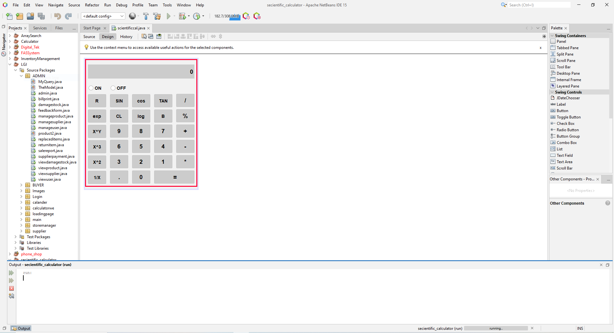
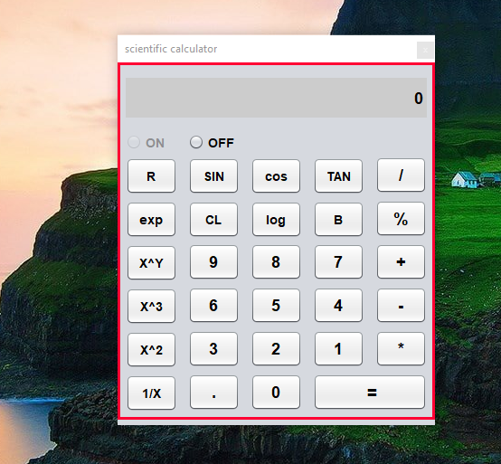

 <h1>JAVA---SCIENCETIFIC-CALCULATOR</h1>
<h4>using JAVA</h4>

<h2>Introduction this SCIENCETIFIC-CALCULATOR project</h2>
The Scientific Calculator Java Project is a software application that aims to provide users with a versatile and powerful tool for performing various scientific calculations. This project is designed to create a user-friendly and feature-rich calculator that can handle a wide range of mathematical and scientific operations. It is an ideal tool for students, scientists, engineers, and anyone else who requires precise and efficient calculations in their work or studies.
<h2>Project GUI</h2>

